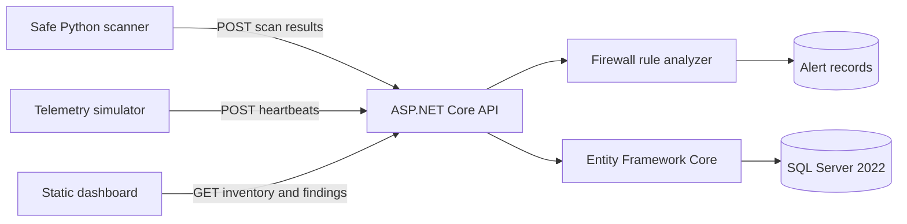

# NetSentinel Architecture

The ASP.NET Core process is the trust boundary for stored lab data. It validates
ingestion contracts, normalizes observations, runs firewall analysis, and serves
the dashboard from the same origin.

The scanner independently enforces its target boundary before any socket is
opened. It accepts only loopback, Docker/private IPv4 addresses, and RFC1918
subnets containing at most 256 addresses. The scanner performs bounded TCP
connection attempts only; it does not capture traffic, identify credentials,
or attempt exploitation.

SQL Server is the only containerized application dependency in the MVP. Keeping
the API and Python processes on the host makes local debugging and portfolio
demonstrations straightforward.
